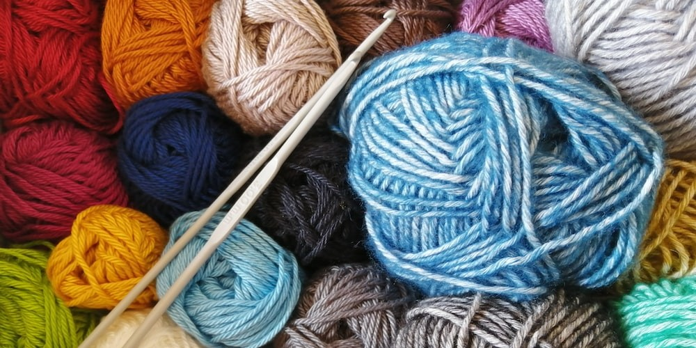

# Knitter's Nook
<p align="center"></p>


## Set Up
1. After you fork and clone this repository, open up the directory on your computer.
1. Scaffold a React app called `knitting` using vite.
    - **NOTE:** This will create a new folder called `knitting` and build the react app inside it.
1. `cd` into `knitting`
1. Remove all the excessive files and code we won't use for this assignment:
    ```
    kintters-nook
    ├── node_modules
    ├── public
    │   └── vite.svg  (delete this)
    └── src
    │   └── assets/
    │   │    └── react.svg (delete this)
    │   ├── App.css (delete this)
    │   ├── App.jsx
    │   ├── index.css
    │   └── main.jsx
    ├── .gitignore
    ├── index.html
    ├── package.json
    ├── package-lock.json
    └── vite.config.js
    ```
1. Create a `components` folder inside the `src` folder.
1. Inside the `components` folder create the following:
    1. `Header`
        1. `index.jsx`
        1. `styles.css`
    1. `Footer`
        1. `index.jsx`
        1. `styles.css`


## The Task
Today you'll be creating a knitting stitch index! 

You can refer to the following websites with knit stitch directories to get an idea of what we'll be building.
- [Toftuk](https://www.toftuk.com/Article_Pages_StitchDirectory.aspx)
- [Studio Knits F](https://www.studioknitsf.com/stitch-patterns-beginner/)
- [Gathered](https://www.gathered.how/knitting-and-crochet/knitting/knitting-stitch-patterns/#Knitting-stitch-patterns-for-beginners)
- [Knitting Fool](https://knittingfool.com/StitchIndex/KF_StitchCatalog.aspx?sort=a)

This app will contain many React Components that will showcase different knitting stitches. Much like your `home.ejs` or `index.ejs` in your Express apps, your `App.jsx` in this case will serve as a sort of index route that will display all of the sample knit stitches provided below.

### Header Component
Think of this component as something similar to an EJS partial. You'll build out all the HTML you need for the Header in `Header/index.jsx`. Once you build out your Header, you can import it into and render it in `App.jsx`.
Your App.js will look something like this:
```js
import './App.css';
import Header from './components/Header';

function App() {
  return (
    <div className="App">
      <Header />
    </div>
  );
}

export default App;
```

#### Your Header should include:
- A title for your site
- A styled background
    - Use your `Header/styles.css` will contain your CSS code


### Footer Component
Similar to the Header component, the Footer component will contain all your HTMl for the footer of your site. Once you build the Footer, import and render it in `App.jsx`.

#### Your Footer should include:
- The title for your site
- A styled background
- Dummy links to social medias


### The App Component
It's time to add some data and dynamically render it using JSX! After your `imports` in `App.jsx` add the following array:
```js
// Knit Stitches
const stitches = [
  {
    name: "Gable",
    image: "https://knittingfool.com/images/thumbs/G/Gable.jpg",
    totalStitches: "10 stitches plus 2 stitches",
    totalRows: "28 rows"
  },
  {
    name: "Garland",
    image: "https://knittingfool.com/images/thumbs/G/Garland.jpg",
    totalStitches: "7 stitches",
    totalRows: "16 rows"
  },
  {
    name: "Garter and Rib Check",
    image: "https://knittingfool.com/images/thumbs/G/GarterAndRibCheck.jpg",
    totalStitches: "10 stitches",
    totalRows: "12 rows"
  },
  {
    name: "Garter Basketweave",
    image: "https://knittingfool.com/images/thumbs/G/GarterBasketweave.jpg",
    totalStitches: "6 stitches plus 1 stitch",
    totalRows: "8 rows"
  },
  {
    name: "Garter Block",
    image: "https://knittingfool.com/images/thumbs/G/GarterBlock.jpg",
    totalStitches: "10 stitches plus 5 stitches",
    totalRows: "12 rows"
  }
]
```
Inside your `App()` function, after the `<Header>` component, use JSX to `map` over the array and dynamically render the data. A simple example where just the is provided below:
```js
...

<ul>
    {
        stitches.map(
            (stitch) => <li>{stitch.name}</li>
        )
    }
</ul>

...
```
Here we can see the `map()` function being used to dynamically create `<li>` elements containing a `stitch.name` inside a `<ul>` element

### Your map() function should render:
- An HTML element (maybe you could use `<div>` or `<figure>` elements...) that serves as a "card" that displays
    - The stitch image
    - The stitch name
    - The total stitches that make up the knit stitch
    - The total rows that make up the knit stitch


## Hungry for More
- Add the CSS and JS Bootstrap CDN's to your `index.html` in the `public` folder. Now, when you add Bootstrap classes to your HTML elements in any component of your app, they'll get styled with Bootstrap!